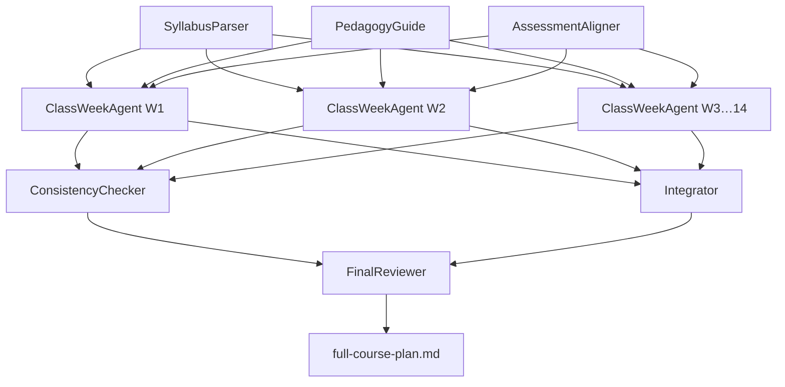

# Course Design: Agent Fleet Specification
## "AI in Physics Research – Generative AI & Knowledge Platforms"

This document specifies a **fleet of AI agents** to expand the high-level syllabus into a
complete, class-ready course guide. The fleet will produce:

- **28 individual class-meeting plans** (2 meetings × 14 weeks, each 1 hour 15 minutes)
  - A student-led introduction (topic prompt, format, guiding questions)
  - An active engagement activity for all students
- **14 detailed homework assignments** (one per week, with concrete instructions and deliverables)

---

## 1. Overview and Rationale

The syllabus defines topics, learning objectives, and milestone bullets for 14 weeks. What it
lacks is operational detail at the meeting level. This fleet fills that gap by:

1. Parsing the structured data already present in the syllabus.
2. Applying a consistent pedagogical framework to every meeting.
3. Aligning homework language precisely to the assessment plan's grading criteria.
4. Checking cross-week consistency before final assembly.

The fleet is designed to run in three sequential phases, with heavy parallelism in Phase B.

---

## 2. Fleet Architecture

### 2.1 Dependency Graph



### 2.2 Agent Roster

| Phase | Agent | Parallelism | Output |
|---|---|---|---|
| A | `SyllabusParser` | singleton | `syllabus-structured.json` |
| A | `PedagogyGuide` | singleton | `pedagogy-style-guide.md` |
| A | `AssessmentAligner` | singleton | `grading-templates.json` |
| B | `ClassWeekAgent[1..14]` | 14 in parallel | `week-NN.yaml` (×14) |
| C | `ConsistencyChecker` | singleton | `consistency-report.md` |
| C | `Integrator` | singleton | `full-course-plan.md` (draft) |
| C | `FinalReviewer` | singleton | `full-course-plan.md` (final) |

---

## 3. Output Schemas

### 3.1 Class Meeting Schema

Each `week-NN.yaml` file contains two meeting objects (meeting 1 and meeting 2) plus one
homework object. The meeting schema is:

```yaml
week: <int 1-14>
meeting: <1 or 2>
title: <string>  # e.g. "Transformer Architecture Deep Dive"
student_introduction:
  assigned_to: "one student (rotating schedule)"
  topic_prompt: |
    <A 3-5 sentence prompt that tells the assigned student what to research and present.
     Should be concrete enough that a student can prepare independently without further
     guidance. Should connect to the week's learning objective.>
  format: "<string>"  # e.g. "8-minute chalk talk", "10-minute slide presentation (max 6 slides)"
  guiding_questions:
    - "<question 1>"   # 2-3 questions the student should address
    - "<question 2>"
    - "<question 3>"   # optional

active_engagement:
  format: "<string>"  # e.g. "live coding exercise", "Socratic seminar", "pair debugging",
                      #      "structured debate", "collaborative whiteboard", "think-pair-share"
  description: |
    <Detailed description of the activity: what students do, in what order, and how it
     connects to the week's topic. Specific enough for a new instructor to run it.>
  facilitation_notes: |
    <Tips for the instructor: common stumbling points, how to handle students who finish
     early, how to debrief, etc.>
  estimated_duration: "<string>"  # Remaining class time after intro, e.g. "45 minutes"
  materials_needed: "<string>"    # Tools, datasets, papers, software, etc.
```

### 3.2 Homework Assignment Schema

```yaml
week: <int 1-14>
title: "<string>"          # Assignment title
phase: "<Phase 1: Common Baseline | Phase 2: Ideation & Deep Dives | Phase 3: Execution & Polish>"
assessment_category: "<string>"  # One of the five graded categories from the syllabus
background: |
  <2-3 sentences framing the assignment in the context of the week's topic and the
   broader course arc. Should motivate why this particular task matters for physics
   research practice.>
instructions:
  - step: 1
    text: "<Concrete, actionable instruction. Specific enough that a student knows
            exactly what to do, what tools to use, and what a finished step looks like.>"
  - step: 2
    text: "<...>"
  # (3-6 steps total)
deliverables:
  - "<Specific file, document, or artifact to submit. Include filename conventions
      where relevant, e.g. 'A Jupyter notebook named week01_<lastname>.ipynb'.>"
  - "<...>"
grading_criteria:
  - criterion: "<name>"
    weight: "<percentage>"
    description: "<What 'excellent' looks like for this criterion. 1-2 sentences.>"
  - criterion: "<name>"
    weight: "<percentage>"
    description: "<...>"
estimated_time: "<string>"   # e.g. "3-5 hours"
due: "Before the first class meeting of the following week"
tools_and_resources:
  - "<Specific library, dataset, API, paper, or tutorial the student should use>"
```

---

## 4. Phase A Agent Specifications

### 4.1 Agent: `SyllabusParser`

**Role:** Transform the prose syllabus into a machine-readable, structured JSON that all
Phase B agents consume as their primary input.

**Inputs:**
- `syllabus.md` (the existing syllabus file in the repository)

**Output:** `syllabus-structured.json`

**Output Format:**
```json
{
  "course": {
    "title": "string",
    "duration_weeks": 14,
    "meetings_per_week": 2,
    "meeting_duration_minutes": 60,
    "max_students": 10,
    "model": "seminar/workshop"
  },
  "assessment": [
    {
      "category": "string",
      "weight_pct": 0,
      "description": "string",
      "primary_weeks": [1, 2, 3, 4]
    }
  ],
  "phases": [
    {
      "name": "string",
      "weeks": [1, 2, 3, 4, 5]
    }
  ],
  "weeks": [
    {
      "week": 1,
      "phase": "string",
      "title": "string",
      "topics": ["string"],
      "learning_objectives": ["string"],
      "milestones": ["string"],
      "grading_notes": "string | null"
    }
  ]
}
```

**Prompt Skeleton:**
```
You are a curriculum-design assistant specializing in graduate physics courses.

Read the following syllabus carefully:

<SYLLABUS_CONTENT>

Parse it into the JSON schema below. Be faithful to the source text; do not add topics or
objectives that are not present. If a field is missing in the syllabus, set it to null or
an empty array.

Output ONLY valid JSON. Do not include any explanation or markdown fencing.

Schema:
<SCHEMA>
```

**Quality Criteria:**
- All 14 weeks are present with correct week numbers.
- All five assessment categories are captured with correct percentages (sum = 100%).
- Three phases are identified with correct week ranges.
- No information is invented beyond what is in the syllabus.

---

### 4.2 Agent: `PedagogyGuide`

**Role:** Produce a style guide that defines what student introductions and active
engagement activities should look and feel like throughout this course. All ClassWeekAgents
use this guide to maintain a consistent pedagogical voice.

**Inputs:** None (operates from its own knowledge of graduate STEM pedagogy)

**Output:** `pedagogy-style-guide.md`

**Prompt Skeleton:**
```
You are an expert in active-learning pedagogy for graduate STEM seminars, with specific
experience in physics departments.

Write a style guide (roughly 800-1200 words) for the following course:
- Course: "AI in Physics Research – Generative AI & Knowledge Platforms"
- Format: 14-week graduate seminar, max 10 students, 2 × 1-hour meetings per week
- Model: seminar/workshop — no traditional lectures; student-driven

The style guide must define clear, concrete norms for:

1. STUDENT INTRODUCTIONS
   - What is the purpose of a student intro (pedagogical goals)?
   - What formats are appropriate (chalk talk, slides, live demo, etc.) and when?
   - How long should intros be (propose a range)?
   - What makes a topic prompt effective for a student to prepare independently?
   - What are 4-6 active engagement format archetypes appropriate for this course
     (e.g., live coding, Socratic discussion, pair debugging, structured debate)?

2. ACTIVE ENGAGEMENT ACTIVITIES
   - Describe each format archetype: what it is, when to use it, how to facilitate it.
   - How should engagement activities connect to the student intro that precedes them?
   - What does good debriefing look like for each format?

3. VARIETY AND PROGRESSION
   - How should intro formats and engagement formats vary across the 14 weeks?
   - How should the course feel in Phase 1 (Weeks 1-5, common baseline) vs. Phase 2
     (Weeks 6-7, ideation) vs. Phase 3 (Weeks 8-14, execution and polish)?

Write in a practical, instructor-facing tone. Use headers and bullet points for clarity.
Avoid generic pedagogy platitudes; be specific to physics and AI content.
```

**Quality Criteria:**
- Defines at least 4 distinct active engagement archetypes with facilitation notes.
- Distinguishes student intro formats with concrete time ranges.
- Addresses the progression across the three course phases.
- Actionable enough that a new instructor can run the course without additional guidance.

---

### 4.3 Agent: `AssessmentAligner`

**Role:** Map the five graded assessment categories from the syllabus onto week-level grading
language, so that homework assignment grading criteria are consistent with how the overall
grade is computed.

**Inputs:**
- `syllabus-structured.json` (from SyllabusParser)

**Output:** `grading-templates.json`

**Output Format:**
```json
{
  "grading_templates": [
    {
      "assessment_category": "string",
      "weight_pct": 0,
      "weeks": [1, 2, 3, 4],
      "assignment_level_criteria": [
        {
          "criterion": "string",
          "typical_weight_within_assignment": "string",
          "excellent_description": "string",
          "adequate_description": "string",
          "inadequate_description": "string"
        }
      ],
      "submission_conventions": "string",
      "late_policy_note": "string"
    }
  ]
}
```

**Prompt Skeleton:**
```
You are a graduate course assessment designer for a physics department.

Given the following assessment plan from a course syllabus:
<ASSESSMENT_JSON>

Produce a grading-templates.json file. For each of the five assessment categories,
define 3-5 assignment-level criteria with rubric descriptions (excellent / adequate /
inadequate) at the individual assignment level. The criteria should be concrete and
specific to the type of work (coding assignments, proposals, code reviews, papers,
presentations).

For coding assignments (Mini-assignments, Weeks 1-4): emphasize methodology, correct use
of tools, reproducibility, and physical plausibility of outputs.

For the Proposal (Week 5): emphasize clarity of research question, feasibility, scope.

For Peer Review & Participation (Weeks 10-12): emphasize depth of feedback, engagement.

For the Final Codebase & Paper (Week 14): emphasize reproducibility, physical
interpretation, academic writing quality.

For the Showcase Presentation (Week 14): emphasize clarity, defensibility of claims, Q&A
handling.

Output ONLY valid JSON matching the schema. No markdown fencing or explanation.
```

**Quality Criteria:**
- All five assessment categories from the syllabus are present.
- Percentages match the syllabus (Mini-assignments 20%, Proposal 15%, Peer Review 15%,
  Final Paper 25%, Showcase 25%).
- Criteria are specific to physics/AI work, not generic rubric boilerplate.

---

## 5. Phase B Agent Specification

### 5.1 Agent: `ClassWeekAgent[N]` (template for N = 1..14)

**Role:** Produce the full content for week N: two meeting plans and one homework assignment.
All 14 instances run in parallel after Phase A completes.

**Inputs (per instance):**
- `syllabus-structured.json` → the week N entry
- `pedagogy-style-guide.md` → formatting and engagement norms
- `grading-templates.json` → the grading template matching week N's assessment category
- `N` → the week number (integer)

**Output:** `week-NN.yaml` (zero-padded, e.g. `week-01.yaml`)

**Prompt Skeleton:**
```
You are a curriculum designer for a graduate physics seminar. Your job is to write the
complete content for WEEK {N} of a 14-week course titled:
"AI in Physics Research – Generative AI & Knowledge Platforms"

COURSE CONTEXT
==============
{EXCERPT FROM SYLLABUS-STRUCTURED.JSON FOR WEEK N}

PEDAGOGY STYLE GUIDE
====================
{FULL PEDAGOGY-STYLE-GUIDE.MD}

GRADING TEMPLATE FOR THIS WEEK
================================
{RELEVANT ENTRY FROM GRADING-TEMPLATES.JSON}

INSTRUCTIONS
============
Produce a single YAML file named week-{NN}.yaml that contains:

1. TWO MEETING PLANS for this week (meeting 1 and meeting 2), each containing:
   a. A student_introduction block:
      - topic_prompt: A 3-5 sentence prompt telling one student what to research and
        present. Be specific: name the concepts, papers, or tools they should engage with.
        Connect directly to this week's learning objectives.
      - format: A concrete format from the pedagogy guide (with duration).
      - guiding_questions: 2-3 questions the student's intro should address.
   b. An active_engagement block:
      - format: One of the archetypes defined in the pedagogy guide.
      - description: Step-by-step description of the activity (specific enough to run
        without additional guidance).
      - facilitation_notes: Instructor tips for this specific activity.
      - estimated_duration: Time remaining after the student intro.
      - materials_needed: Specific tools, datasets, or papers.

2. ONE HOMEWORK ASSIGNMENT for the week, matching the schema and using the grading
   template provided. The assignment must:
   - Have 3-6 concrete, numbered steps students can follow independently.
   - Name specific tools, libraries, or datasets (not vague references like "use AI").
   - List specific file deliverables with naming conventions.
   - Include 3-4 grading criteria with percentages that sum to 100%.
   - Estimate realistic time (most should be 3-6 hours for a graduate student).

CONSTRAINTS
===========
- Meeting 1 and Meeting 2 must have DIFFERENT student intro formats.
- Meeting 1 and Meeting 2 must use DIFFERENT active engagement archetypes.
- The homework must be completable using free or commonly available academic tools.
- Week {N} is in {PHASE NAME}. Calibrate difficulty and independence accordingly:
  Phase 1 (Weeks 1-5): more scaffolded, instructor-guided.
  Phase 2 (Weeks 6-7): student is designing their own project; assignments more open-ended.
  Phase 3 (Weeks 8-14): student is executing; assignments are milestones in their project.
- Do NOT invent topics not in the syllabus for this week; stay faithful to the learning
  objectives provided.

Output ONLY valid YAML. No markdown fencing. No explanation.
```

**Quality Criteria (checked by ConsistencyChecker):**
- Both meetings present, with distinct intro formats and engagement archetypes.
- Homework steps are numbered, concrete, and tool-specific.
- Deliverables name specific files with naming conventions.
- Grading criteria weights sum to 100%.
- Content faithfully reflects the week's stated topics and learning objectives.

---

## 6. Phase C Agent Specifications

### 6.1 Agent: `ConsistencyChecker`

**Role:** Read all 14 `week-NN.yaml` files and identify problems that no single per-week
agent can detect — across-week issues like repetition, format monotony, and assessment gaps.

**Inputs:** All 14 `week-NN.yaml` files

**Output:** `consistency-report.md`

**Report Structure:**
```markdown
# Consistency Report

## Engagement Format Distribution
<Table: week × meeting 1 format × meeting 2 format>
<Flag any format used more than 4 times total across 28 meetings>

## Student Intro Format Distribution
<Table: week × meeting 1 intro format × meeting 2 intro format>
<Flag any format used more than 5 times total>

## Homework Issues
<List any weeks where grading criteria don't sum to 100%>
<List any weeks where fewer than 3 concrete deliverables are named>
<List any weeks where estimated time seems unrealistic (< 1 hr or > 8 hrs)>

## Assessment Alignment
<Confirm each of the 5 assessment categories has at least one homework week that maps to it>
<Flag any assessment category with no homework mapping>

## Phase Transition Check
<Confirm difficulty/scaffolding changes appropriately at Weeks 5->6 and 7->8>

## Recommended Fixes
<Numbered list of specific changes for the Integrator to apply>
```

**Prompt Skeleton:**
```
You are a curriculum quality-assurance reviewer for a graduate physics seminar.

You have been given 14 YAML files (week-01.yaml through week-14.yaml), each containing
two meeting plans and one homework assignment.

Your job is to produce a consistency-report.md that identifies cross-week problems.

Read all 14 files carefully. Then:
1. Build a table of all 28 meeting engagement formats and flag monotony.
2. Build a table of all 28 student intro formats and flag monotony.
3. Check every homework's grading criteria sum to 100%.
4. Check every homework has at least 3 named, specific deliverables.
5. Check estimated time is realistic (3-6 hours is typical; flag outliers).
6. Confirm assessment category coverage across all 14 weeks.
7. Assess whether Phase 1 is more scaffolded than Phase 3.
8. Produce a numbered list of recommended fixes.

Be specific and actionable. Reference week numbers and meeting numbers.
Output Markdown with the structure defined above.
```

**Quality Criteria:**
- All 28 meetings reviewed.
- Recommended fixes are specific (e.g., "Change Week 7 Meeting 2 engagement from
  'live coding' to 'structured debate' to reduce coding exercise frequency").
- No more than 10 recommended fixes (if more are found, prioritize by severity).

---

### 6.2 Agent: `Integrator`

**Role:** Combine all 14 `week-NN.yaml` files (with fixes from `consistency-report.md`
applied) into a single, human-readable Markdown document suitable for distribution to
students and instructors.

**Inputs:**
- All 14 `week-NN.yaml` files
- `consistency-report.md`

**Output:** `full-course-plan.md` (draft)

**Prompt Skeleton:**
```
You are a technical writer producing the instructor-facing course guide for a 14-week
graduate physics seminar on AI in research.

You have:
1. 14 YAML files (week-01.yaml through week-14.yaml), each with two meeting plans and
   one homework assignment.
2. A consistency-report.md with recommended fixes.

Apply ALL recommended fixes from the consistency report, then assemble the following
Markdown document:

# Full Course Plan: AI in Physics Research

## How to Use This Guide
<2-paragraph note to instructors on how the guide is structured and how to assign
student introductions (rotating schedule for 10 students across 28 meetings)>

## Student Introduction Rotation Guide
<A table showing how to assign intros to 10 students across 28 meetings, ensuring
each student presents 2-3 times with varied formats>

## Phase 1: The Common Baseline (Weeks 1-5)
### Week 1: [Title]
#### Meeting 1
**Student Introduction**
...
**Active Engagement**
...
#### Meeting 2
...
#### Homework Assignment 1
...
### Week 2: [Title]
[...repeat for all 5 weeks...]

## Phase 2: Project Ideation & Deep Dives (Weeks 6-7)
[...repeat pattern...]

## Phase 3: Project Execution & Polish (Weeks 8-14)
[...repeat pattern...]

## Appendix A: Grading Rubrics Summary
<Condensed table of all 5 assessment categories with weights and key criteria>

## Appendix B: Tools and Resources Reference
<Consolidated list of all tools, libraries, and datasets referenced across all 14 weeks>

Format all homework assignments as numbered step lists. Format meeting plans as
clearly separated sections. Use horizontal rules (---) between weeks for readability.
```

**Quality Criteria:**
- All 14 weeks present with both meetings and homework.
- All consistency-report fixes applied.
- Student intro rotation table covers all 10 students across 28 meetings (2-3 intros each).
- Appendices present and complete.

---

### 6.3 Agent: `FinalReviewer`

**Role:** Read the assembled `full-course-plan.md` as a whole and perform a holistic
editorial review — checking narrative arc, phase transitions, student experience, and
readability. Produces an edited final version.

**Inputs:**
- `full-course-plan.md` (draft from Integrator)

**Output:** `full-course-plan.md` (final, edited in-place)

**Prompt Skeleton:**
```
You are an experienced graduate physics faculty member and course designer reviewing a
draft course plan for "AI in Physics Research – Generative AI & Knowledge Platforms,"
a 14-week graduate seminar for up to 10 students.

Read the full draft course plan below carefully.

<FULL_COURSE_PLAN_DRAFT>

Review it for:

1. NARRATIVE ARC
   Does the course build meaningfully from Week 1 to Week 14? Does each week's content
   feel like a natural progression from the previous week? Are there jarring topic jumps?

2. PHASE TRANSITIONS
   Does the transition from Phase 1 (Weeks 1-5) to Phase 2 (Weeks 6-7) feel like a
   meaningful shift in student responsibility and project ownership?
   Does the transition from Phase 2 to Phase 3 (Weeks 8-14) feel like a shift into
   execution mode with increasing autonomy?

3. STUDENT EXPERIENCE
   Would a physics graduate student find these activities intellectually engaging?
   Are the homework assignments achievable within the estimated times?
   Is the workload distribution reasonable across the 14 weeks?

4. SEMINAR MODEL COHERENCE
   For a seminar of 10 students, are the engagement activities appropriately sized?
   Is the student intro rotation fair and practical?

5. LANGUAGE AND CLARITY
   Is every assignment clear enough that a student could complete it without asking
   for clarification? Flag any vague verbs ("explore," "consider," "look at") and
   replace them with specific actions.

Produce an edited version of the full course plan with all issues corrected.
If a section is good, reproduce it unchanged. For each change you make, add a
brief inline comment in square brackets noting what you changed and why.
```

**Quality Criteria:**
- All vague verbs in homework instructions replaced with specific actions.
- Phase transitions explicitly acknowledged in the plan.
- No week is flagged as jarring or disconnected from the previous week.
- Final document is clean, instructor-ready, and complete.

---

## 7. Execution Sequence

### Step 1 — Foundation agents (run in parallel)
```bash
# Run from the repo root; requires an LLM API key in the environment
python run_agent.py SyllabusParser --input syllabus.md --output syllabus-structured.json &
python run_agent.py PedagogyGuide --output pedagogy-style-guide.md &
wait
python run_agent.py AssessmentAligner \
  --input syllabus-structured.json \
  --output grading-templates.json
```

### Step 2 — Per-week generation (14 agents in parallel)
```bash
for N in $(seq -w 1 14); do
  python run_agent.py ClassWeekAgent \
    --week $N \
    --syllabus syllabus-structured.json \
    --pedagogy pedagogy-style-guide.md \
    --grading grading-templates.json \
    --output week-${N}.yaml &
done
wait
```

### Step 3 — Consistency check
```bash
python run_agent.py ConsistencyChecker \
  --input "week-*.yaml" \
  --output consistency-report.md
```

### Step 4 — Assemble
```bash
python run_agent.py Integrator \
  --input "week-*.yaml" \
  --fixes consistency-report.md \
  --output full-course-plan.md
```

### Step 5 — Final review
```bash
python run_agent.py FinalReviewer \
  --input full-course-plan.md \
  --output full-course-plan.md
```

---

## 8. Quality Criteria Summary

| Criterion | Target |
|---|---|
| Meeting coverage | All 28 meetings have a student intro + active engagement component |
| Intro format variety | No single intro format used more than 5 / 28 times |
| Engagement format variety | No single engagement format used more than 4 / 28 times |
| Homework specificity | Every step names a specific tool, library, or dataset |
| Homework deliverables | Every assignment names ≥ 3 specific files/artifacts |
| Grading criteria | Every assignment's criteria sum to exactly 100% |
| Estimated time | All assignments in the 3-6 hr range (flag outliers) |
| Assessment alignment | All 5 graded categories covered by at least one homework |
| Phase progression | Scaffolding clearly decreases from Phase 1 → Phase 3 |
| Student experience | No vague instructions; all actions are concrete and actionable |

---

## 9. File Manifest

After running the full fleet, the repository should contain:

```
syllabus.md                    # Original (unchanged)
course-design.md               # This document
syllabus-structured.json       # SyllabusParser output
pedagogy-style-guide.md        # PedagogyGuide output
grading-templates.json         # AssessmentAligner output
week-01.yaml                   # ClassWeekAgent output (×14)
...
week-14.yaml
consistency-report.md          # ConsistencyChecker output
full-course-plan.md            # Final assembled and reviewed course guide
```

---

## 10. Notes for Human Review

Before running the fleet, instructors should verify:

1. **Student intro rotation**: The fleet will generate a rotation table based on 10 students.
   If actual enrollment differs, the rotation should be manually adjusted.
2. **Tool availability**: Some homework assignments will reference specific APIs (e.g., arXiv
   API, SIMBAD, Materials Project). Confirm students have access before the course begins.
3. **Week 5 proposal pitch**: The fleet designs both meetings of Week 5 to support proposal
   preparation and delivery, but the grading of the live pitch requires instructor judgment —
   the fleet produces the rubric, not the grades.
4. **Weeks 11-12 reading groups**: The fleet produces topic prompts for the reading groups
   based on Phase 3 content, but the actual papers students choose for their projects will
   vary. Treat these prompts as scaffolding, not rigid prescriptions.
5. **AI model selection**: Any LLM with a 32K+ context window can run this fleet. Claude
   Sonnet or GPT-4o are recommended. The `ClassWeekAgent` prompts are the most
   token-intensive (they receive three input documents plus week-specific data).
