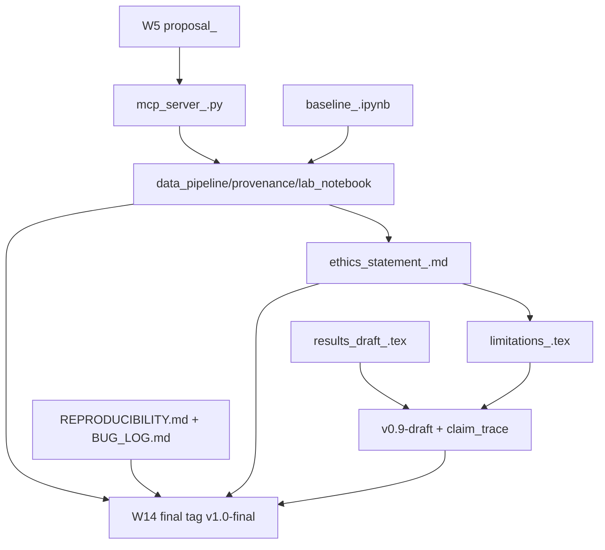

# Internal Consistency Review
## AI in Physics Research Course Artifacts

## 1. Executive Summary

This review is focused on **internal consistency and implementation readiness** for the next build phase.

| Metric | Count | Source |
|---|---:|---|
| Core consistency issues (formal audits) | 22 | `file_audit.json`, `crossweek_audit.json`, `convention_audit.json` |
| Blocking core issues | 11 | 8 missing artifacts + 3 high-severity convention issues |
| Important core issues | 7 | 1 missing artifact + 2 cross-week warnings + 4 medium convention issues |
| Informational core issues | 4 | 2 cross-week info + 2 low convention issues |
| Operational readiness checklist items | 52 | `instructor_materials_audit.json` |
| Operational blockers | 39 | instructor checklist priority `BLOCKING` |

Top risk: missing instructor-provided exercise artifacts (9 files; 8 blocking) and unresolved naming/deadline conventions that can create grading ambiguity.

## 2. Scope and Method

Inputs reviewed:
- `file_audit.json`, `crossweek_audit.json`, `convention_audit.json`, `instructor_materials_audit.json`
- `week-01.yaml` ... `week-14.yaml`
- `docs/full-course-plan.md`
- `docs/syllabus.md`

Method:
1. Consolidated formal issue records from all audit JSONs.
2. Cross-checked dependency and deadline claims against week YAML references.
3. Validated URL reachability snapshots (HTTP/redirect checks) and compared with stability metadata.
4. Produced implementation-facing specs for missing artifacts, conventions, and rollout sequencing.

## 3. High-Severity Findings (Blocking)

| ID | Finding | Evidence | Impact | Required action |
|---|---|---|---|---|
| B-01 | 8 blocking missing repo artifacts | `file_audit.json.missing_files` | Week execution failure in W1/W2/W3/W6/W8/W9 meetings | Create and pre-test all missing blocking files before first dependent meeting |
| B-02 | Peer-review filename schema inconsistency (W10 vs W12) | `convention_audit.json.issues[0]` | Student confusion + grading mismatch across equivalent roles | Standardize placeholders and naming across both weeks |
| B-03 | APS policy URL likely stale (`.cfm`) | `convention_audit.json.issues[1]` | In-class materials may point to dead/redirecting policy page | Replace with verified canonical APS policy URL |
| B-04 | External dependency on personal repo (`github.com/hackergrrl/art-of-readme`) | `convention_audit.json.issues[2]` | Single-point external failure for W12 reading material | Pin commit hash or replace with controlled mirror/internal excerpt |
| B-05 | 39 blocking instructor readiness items unclosed | `instructor_materials_audit.json.summary.by_priority.BLOCKING` | Course delivery cannot run consistently | Convert checklist into dated owner-tracked runbook |

## 4. Important Findings (Non-blocking but high impact)

| ID | Finding | Count/Scope | Impact | Action |
|---|---|---:|---|---|
| I-01 | Important missing file: fallback corpus | 1 | W3 M1 resilience reduced during API failure | Add `week03_fallback_corpus.json` |
| I-02 | Dual-deadline ambiguity (W10 Step 3 graded in W12) | 1 | Students miss delayed graded component | Add explicit cross-week grading note to W10 + W12 |
| I-03 | Implicit v0.9→v1.0 tag dependency | 1 | W14 final can bypass W13 checkpoint intent | Add explicit precondition in W14 Step 2 |
| I-04 | Model alias unpinned (`claude-3-5-sonnet`) | 8 mentions | Reproducibility drift over time | Pin dated model ID or add explicit alias policy |
| I-05 | Missing URL scheme / non-specific URLs | 14 missing schemes; 2 root-domain refs | Rendering ambiguity + student navigation friction | Normalize all URLs to full `https://...` targets |

## 5. Informational Findings (Cleanup / quality)

| ID | Finding | Impact | Action |
|---|---|---|---|
| N-01 | W14 says “No new work” but adds self-assessment deliverable | Messaging inconsistency | Reword estimated-time statement |
| N-02 | W12 grading bundles reviewer audit + author response | Rubric interpretation ambiguity | Split criterion or define split weighting |
| N-03 | “Claude claude-3-5-sonnet” mixed label style | Cosmetic inconsistency | Normalize prose/model notation |
| N-04 | Optional package advisories (`langchain`, `llama-index`) | Install/version churn risk | Add version pins or current package names |

## 6. Missing Artifact Manifest (with required specs)

### 6.1 Exercise files

| Path | Owner | When needed | Required contents (spec) | Dependency consumers |
|---|---|---|---|---|
| `exercises/week01/meeting1_token_explorer.ipynb` | Course staff | W1 M1 | - tiktoken demo cell  \n- `count_tokens()` stub  \n- buggy OpenAI call (misspelled model + temp=2.0) | W1 M1 live coding; W1 HW reliability framing |
| `week02_buggy_harmonic_oscillator.py` | Course staff | W2 M1 | Exactly 5 planted bugs: zero-point, off-by-one, hallucinated API, normalization, `psi` vs `|psi|^2` | W2 M1 bug hunt; W2 HW bug taxonomy alignment |
| `week02_test_driven_skeleton.ipynb` | Course staff | W2 M2 | Projectile-drag problem + 5 prewritten pytest tests + 3 empty labeled cells | W2 M2 test-driven prompting activity |
| `week02_starter/ai_generated_oscillator.py` | Course staff | W2 HW | AI-generated script with same 5 bug classes as in-class file | W2 HW Steps 1–4 |
| `week03_rag_skeleton.ipynb` | Course staff | W3 M1 | Stubs: `fetch_abstracts`, `embed_texts`, `build_index`, `retrieve`, `answer_with_rag` | W3 M1 live build; W3 HW continuation |
| `week03_fallback_corpus.json` | Course staff | W3 M1 | 30 abstracts; each has `id,title,authors,abstract,url` | W3 M1 fallback path when arXiv API fails |
| `skeleton_mcp_server.py` | Course staff | W6 M1 | Working MCP server + `unit_convert` tool + JSON schema declarations | W6 M1 extension exercise; W6 HW server build |
| `multi_api_pipeline_broken.py` | Course staff | W8 M2 | 3 planted failures: swallowed rate-limit, unit mismatch, missing `.get()` guard | W8 M2 pair debugging lab |
| `agentic_bug_hunt.py` | Course staff | W9 M1 | 60-line script; 3 failures: silent empty result, token overflow @ iter4, no random seed | W9 M1 reproducibility/debugging lab |

### 6.2 Forms and rubrics

| Artifact | Owner | When needed | Required contents |
|---|---|---|---|
| Structured pitch peer-feedback form | Instructor | W5 M2 | 3 fields: strength, feasibility question, concrete improvement |
| Instructor pitch evaluation sheet | Instructor | W5 M2 | rubric: specificity, feasibility, delivery, guiding-question coverage |
| Debate brief (FOR) | Instructor | W10 M1 | one-page pro-caption-disclosure argument with APS/Nature references |
| Debate brief (AGAINST) | Instructor | W10 M1 | one-page counterargument mirroring FOR structure |
| Peer code-review rubric | Instructor | W10 M2 | 4 sections: reproducibility, seeds/secrets, claim traceability, AI disclosure |
| Reproducibility audit checklist | Instructor | W12 M2 | 5 checks: clone test, figure provenance, data provenance, secrets, output stability |
| Practice showcase feedback form | Instructor | W13 M2 | 4 checks: clarity, quantified result, method explainability, improvement suggestion |
| Tailored adversarial question bank | Instructor | W14 M1 | one project-specific methodology stress-test question per student |

### 6.3 Suggested repository tree

```text
exercises/
  week01/meeting1_token_explorer.ipynb
week02_buggy_harmonic_oscillator.py
week02_test_driven_skeleton.ipynb
week02_starter/ai_generated_oscillator.py
week03_rag_skeleton.ipynb
week03_fallback_corpus.json
week04_mcp_skeleton/
  requirements.txt
  mcp_server_stub.py
  cached/simbad_betelgeuse.json
skeleton_mcp_server.py
multi_api_pipeline_broken.py
multi_api_pipeline_solution.py
agentic_bug_hunt.py
instructor/
  forms/
  rubrics/
  debate-briefs/
```

## 7. Cross-Week Dependency Validation

### 7.1 Dependency graph



### 7.2 Validated chains

- 12/12 dependency-chain records are marked `VALID` in `crossweek_audit.json`.
- Highest-risk implicit chains:
  - W13 `v0.9-draft` → W14 `v1.0-final` (not explicitly enforced)
  - W10 Step 3 responses → W12 grading (cross-week grading dependency not obvious in W10 grading section)

### 7.3 Deadline and grading ambiguities

| Topic | Current state | Required fix |
|---|---|---|
| W10 delayed component | Main due before W11 M1; responses due before W12 M1 | Add bold “graded in W12” callout in W10 HW + rubric row |
| W14 “No new work” statement | Contradicts post-showcase `self_assessment_<lastname>.md` | Reword to “No new code/paper sections; one new reflective deliverable remains” |
| W12 mixed criterion | reviewer audit and author response combined | Split into two weighted sub-criteria |

## 8. Naming, Placeholder, and File Convention Audit

### 8.1 Current variants

- `<lastname>` (dominant single-author placeholder)
- `<your_lastname>`, `<partner_lastname>` (W10 peer review)
- `<reviewer>`, `<author>` (W12 reproducibility audit)
- Special persistent root files: `REPRODUCIBILITY.md`, `BUG_LOG.md`, `REVIEW_RESPONSES.md`

### 8.2 Proposed canonical standard

| Category | Canonical rule |
|---|---|
| Single-author deliverables | `<lastname>` |
| Reviewer role placeholder | `<reviewer_lastname>` |
| Reviewed/author role placeholder | `<author_lastname>` |
| Peer review file | `peer_review_<reviewer_lastname>_reviews_<author_lastname>.md` |
| Repro audit file | `reproducibility_audit_<reviewer_lastname>_reviews_<author_lastname>.md` |
| Root persistent files | ALL_CAPS fixed names without lastname suffix |

### 8.3 Migration mapping table

| Existing schema | Canonical schema |
|---|---|
| `peer_review_<your_lastname>_reviews_<partner_lastname>.md` | `peer_review_<reviewer_lastname>_reviews_<author_lastname>.md` |
| `reproducibility_audit_<reviewer>_reviews_<author>.md` | `reproducibility_audit_<reviewer_lastname>_reviews_<author_lastname>.md` |
| `Claude claude-3-5-sonnet` (prose) | `Claude (claude-3-5-sonnet-20241022)` |

## 9. URL / Tool / Model Reference Audit

### 9.1 URL validation matrix

Status legend used here: `Verified`, `Likely stale`, `Needs manual check`.

| URL | Status | Rationale |
|---|---|---|
| `https://platform.openai.com/docs/quickstart` | Verified | 200; redirects to developers.openai.com quickstart |
| `https://docs.anthropic.com/en/api/getting-started` | Verified | 200; redirects to platform.claude.com docs |
| `https://pdg.lbl.gov` | Verified | 200 stable |
| `https://physics.nist.gov/PhysRefData` | Needs manual check | 403 from headless check; likely bot protection |
| `https://www.aps.org/policy/statements/ai-generated-text.cfm` | Likely stale | legacy `.cfm`; flagged unstable in audit |
| `https://claude.ai` | Needs manual check | 403 from headless check |
| `https://pypi.org/project/arxiv/` | Verified | 200 stable |
| `modelcontextprotocol.io` | Verified | resolves to docs landing page |
| `modelcontextprotocol.io/specification` | Verified | resolves to versioned spec path |
| `simbad.u-strasbg.fr` | Likely stale | deprecated host; should migrate to `simbad.cds.unistra.fr` |
| `arxiv.org/help/api` | Likely stale | returns 404 |
| `materialsproject.org/api` | Needs manual check | 403 headless; likely auth/front-end behavior |
| `astroquery.readthedocs.io` | Verified | 200 |
| `https://api.materialsproject.org` | Verified | 200; resolves to docs |
| `mermaid.js.org` | Verified | 200 |
| `diagrams.net` | Verified | redirects to draw.io |
| `nature.com/articles/d41586-023-00191-1` | Needs manual check | 200 with cookie gate query params |
| `aps.org` | Needs manual check | root domain only + 403 headless |
| `nature.com` | Needs manual check | root domain only; non-specific policy reference |
| `google.github.io/eng-practices/review/reviewer/` | Verified | 200 |
| `journals.aps.org/prd/authors` | Needs manual check | 403 headless |
| `https://doi.org/10.1126/science.359.6377.725` | Needs manual check | DOI responded 403 in headless run |
| `https://doi.org/10.1016/j.patter.2023.100804` | Verified | redirects to Elsevier landing |
| `github.com/hackergrrl/art-of-readme` | Needs manual check | currently 200, but personal repo persistence risk |
| `paperswithcode.com` | Needs manual check | redirects to HF trending route; content target ambiguous |
| `software.ac.uk/resources/guides/how-write-readme` | Likely stale | returns 404 |

### 9.2 Tool/package naming checks

| Item | Audit status | Action |
|---|---|---|
| `mp-api` | Correct | No change |
| `faiss-cpu` | Correct | No change |
| `python-json-logger` | Correct | No change |
| `langchain` (optional) | Advisory | Pin supported version if used |
| `llama-index` (optional) | Advisory | Prefer `llama-index-core` or explicit modern package/version |

### 9.3 Model pinning and reproducibility risks

| Model reference | Risk | Recommendation |
|---|---|---|
| `claude-3-5-sonnet` alias | alias can drift | Pin `claude-3-5-sonnet-20241022` (or declare alias policy) |
| `gpt-4o-mini` alias | implicit version drift | Add model-version logging requirement in Week 1 template |
| mixed prose form (`Claude claude-3-5-sonnet`) | inconsistent notation | Standardize brand/model formatting |

## 10. Instructor Operational Readiness Checklist

### 10.1 Pre-course (Day 0) checklist

- Publish/verify all blocking starter artifacts required by W1–W3.
- Add fallback provider instructions (litellm/Groq) to README.
- Pre-print W1 ethics packet and question prompt.
- Confirm API key onboarding instructions in syllabus and onboarding email.

### 10.2 Rolling weekly prep checklist

| Category | Count | Immediate implementation requirement |
|---|---:|---|
| `PRE_CLASS_ACTION` | 24 | convert each to dated runbook task with owner |
| `REPO_FILE` | 12 | verify file exists + execution smoke test |
| `STUDENT_PREREQ` | 5 | automate reminder schedule (48h/24h checkpoints) |
| `INSTRUCTOR_FORM` | 8 | template and store under version control |
| `PRINT_MATERIAL` | 3 | produce printable source artifacts |

### 10.3 Showcase preparation checklist

- W13 M2+24h: compile and distribute practice feedback per student.
- W14 M1-48h: notify adversarial Q&A format.
- W14 M1: complete tailored question bank from paper drafts.
- W14 M2-2w: reserve room and send invitations.
- W14 M2-24h: collect/verify all slide decks.

## 11. Implementation Roadmap for Next Phase

### Phase 0 — Critical unblockers

| Task ID | Deliverable | Done condition |
|---|---|---|
| P0-01 | Create 9 missing artifacts in §6.1 | File existence + smoke tests pass |
| P0-02 | Standardize peer-review placeholder schemas | W10/W12 YAML + docs use canonical placeholders |
| P0-03 | Replace/repair likely stale URLs | No `Likely stale` URLs remain in YAML/docs |
| P0-04 | Convert 39 blocking instructor items into dated runbook | Owner + due date set for each blocker |

### Phase 1 — Consistency hardening

| Task ID | Deliverable | Done condition |
|---|---|---|
| P1-01 | Explicit W13→W14 tag dependency language | W14 references `v0.9-draft` checkpoint |
| P1-02 | Clarify W10/W12 grading handoff | W10 rubric points to W12 grading criterion |
| P1-03 | Model pinning policy statement | Week templates require dated model IDs or justified aliases |
| P1-04 | Normalize URL scheme to explicit `https://` | 0 scheme-less URLs in week YAML/docs |

### Phase 2 — Quality improvements

| Task ID | Deliverable | Done condition |
|---|---|---|
| P2-01 | Add machine-checkable convention lint | CI fails on placeholder/schema drift |
| P2-02 | Add weekly readiness dashboard | Checklist status visible by week/type/priority |
| P2-03 | Add link-check workflow with allowlist | CI report for 2xx/3xx + manual-check exceptions |
| P2-04 | Split ambiguous rubric criteria | W12 rubric has distinct reviewer vs author scoring rows |

## 12. Acceptance Criteria for Implementation Completion

**CI-checkable criteria**
1. All 9 missing artifacts exist at exact required paths.
2. URL checker reports: 0 `Likely stale`, 0 missing-scheme URLs.
3. Naming checker reports canonical peer-review/repro-audit schemas only.
4. Static content check confirms W14 mentions `v0.9-draft` dependency.
5. Model-reference check flags no ungoverned alias usage.

**Manual review criteria**
1. Instructor runbook covers all 39 blocking checklist items with owner/date.
2. Each starter artifact executes in target classroom environment.
3. W10/W12 grading language is understandable without cross-document inference.
4. Showcase ops timeline is communicated and acknowledged by students.

## 13. Appendix

### 13.1 Full issue register table

| Source | Severity | Count |
|---|---|---:|
| `file_audit.json` | BLOCKING | 8 |
| `file_audit.json` | IMPORTANT | 1 |
| `crossweek_audit.json` | WARNING | 2 |
| `crossweek_audit.json` | INFO | 2 |
| `convention_audit.json` | HIGH | 3 |
| `convention_audit.json` | MEDIUM | 4 |
| `convention_audit.json` | LOW | 2 |
| `instructor_materials_audit.json` (operational) | BLOCKING | 39 |
| `instructor_materials_audit.json` (operational) | IMPORTANT | 12 |
| `instructor_materials_audit.json` (operational) | RECOMMENDED | 1 |

### 13.2 Traceability matrix (issue → source week/line context)

| Issue ID | Issue summary | Source context |
|---|---|---|
| B-01a | Missing `meeting1_token_explorer.ipynb` | `week-01.yaml:31` references required path |
| B-01b | Missing `week02_buggy_harmonic_oscillator.py` | `week-02.yaml:34,65,105` |
| B-01c | Missing `week02_test_driven_skeleton.ipynb` | `week-02.yaml:140,210` |
| B-01d | Missing `week02_starter/ai_generated_oscillator.py` | `week-02.yaml:233` |
| B-01e | Missing `week03_rag_skeleton.ipynb` | `week-03.yaml:72,261` |
| I-01 | Missing `week03_fallback_corpus.json` | `week-03.yaml:73` |
| B-01f | Missing `skeleton_mcp_server.py` | `week-06.yaml:30,71` |
| B-01g | Missing `multi_api_pipeline_broken.py` | `week-08.yaml:89` |
| B-01h | Missing `agentic_bug_hunt.py` | `week-09.yaml:20,29` |
| B-02 | W10/W12 review naming mismatch | `week-10.yaml:68,73`; `week-12.yaml:99` |
| I-02 | W10 delayed response due date | `week-10.yaml:70,85`; `week-12.yaml:124-126,145` |
| I-03 | Implicit v0.9→v1.0 progression | `week-13.yaml:69,74`; `week-14.yaml:68,75` |
| N-01 | “No new work” contradiction | `week-14.yaml:91` vs `week-14.yaml:72,77` |
| B-03 | APS `.cfm` policy link instability | `week-01.yaml:208`; convention issue category `url_stability` |
| I-05a | Missing URL schemes / root domains | examples: `week-04.yaml:189,192`; `week-10.yaml:88,89`; `week-12.yaml:65` |
| I-04 | Unpinned `claude-3-5-sonnet` alias use | e.g., `week-02.yaml:12,168,226,264`; `week-05.yaml:148`; `week-10.yaml:66` |
| N-03 | Brand/model collision | `week-05.yaml:148` (“Claude claude-3-5-sonnet”) |
